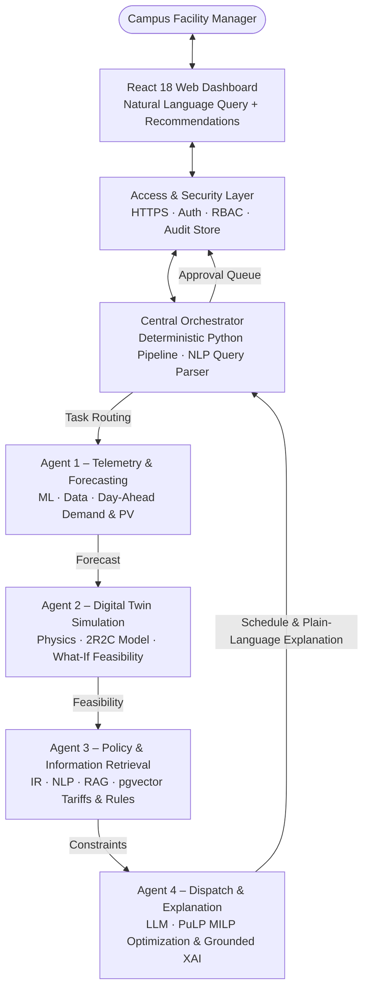

# CampusGrid AI: Master Architectural Blueprint, System Requirements Specification (SRS) & Engineering Implementation Guide

**Document Identifier:** CG-MASTER-ARCH-SRS-2026-V4.1  
**Project Title:** CampusGrid AI — Autonomous Multi-Agent Microgrid Energy Management System & Cyber-Physical Digital Twin  
**Course Code:** IT 3041 – Information Retrieval and Web Analytics (IRWA)  
**Academic Lead:** Mr. Samadhi Chathuranga Rathnayake  
**Target Architecture Version:** Production v4.1 (Unified Master Document)  
**Author Role:** Senior Principal System Architect & Lead Cyber-Physical Systems Engineer  

---

## Executive Table of Contents
1. [Executive Summary & High-Level System Concept](#1-executive-summary--high-level-system-concept)
2. [The Real-World Domain Problem: The 15-Minute Peak Demand Trap](#2-the-real-world-domain-problem-the-15-minute-peak-demand-trap)
3. [The "One Step Ahead" Human-in-the-Loop Governance Model](#3-the-one-step-ahead-human-in-the-loop-governance-model)
4. [End-to-End System Architecture & Decoupled Topology](#4-end-to-end-system-architecture--decoupled-topology)
5. [Multi-Agent System Architecture & Inter-Agent Protocols](#5-multi-agent-system-architecture--inter-agent-protocols)
6. [Mathematical & Physics Formulations (2R2C Thermal Physics & MILP Optimizer)](#6-mathematical--physics-formulations-2r2c-thermal-physics--milp-optimizer)
7. [Information Retrieval (Hybrid Dense/Sparse RAG) & Explicit NLP Engine](#7-information-retrieval-hybrid-densesparse-rag--explicit-nlp-engine)
8. [Web Analytics & User Telemetry Engine (Core IRWA Module)](#8-web-analytics--user-telemetry-engine-core-irwa-module)
9. [Responsible AI Governance, Ethical Guardrails & Priority Tiers](#9-responsible-ai-governance-ethical-guardrails--priority-tiers)
10. [Sri Lankan Commercialization, Business Model & LKR Pricing Architecture](#10-sri-lankan-commercialization-business-model--lkr-pricing-architecture)
11. [Target Codebase Architecture & Production Code Skeletons](#11-target-codebase-architecture--production-code-skeletons)
12. [4-Member Task Distribution, Sprint Roadmap & Live Demo Script](#12-4-member-task-distribution-sprint-roadmap--live-demo-script)
13. [Senior Architect’s Viva Voce Defense Master Guide (18 Key Q&As)](#13-senior-architects-viva-voce-defense-master-guide-18-key-qas)

---

# 1. Executive Summary & High-Level System Concept

### 1.1 What is CampusGrid AI?
**CampusGrid AI** is an autonomous, distributed multi-agent cyber-physical energy management system (EMS) designed specifically for university campuses and large institutional facilities. It functions as an intelligent co-pilot and real-time simulator that:
1. **Monitors** power consumption, solar generation, weather conditions, and room occupancy across campus buildings.
2. **Forecasts** 24-hour electricity demand and rooftop solar generation using machine learning models.
3. **Simulates "What-If" Scenarios** inside a virtual computer replica of the campus (a **Physics-based Digital Twin**) without endangering real physical equipment.
4. **Calculates Optimal Schedules** for battery charging/discharging and HVAC precooling using mathematical optimization (**Mixed-Integer Linear Programming - MILP**).
5. **Retrieves Official Regulations** (PUCSL electricity tariffs, ASHRAE thermal comfort standards) via a **Hybrid RAG** engine.
6. **Instruments Web Analytics** to track administrator search intents, acceptance funnels, and run A/B tests on AI explanations.
7. **Explains Every Action in Plain English** to facility directors and bursars through natural language Explainable AI (XAI).

```
+──────────────────────────────────────────────────────────────────────────────────────────+
|                                    HOW CAMPUSGRID AI OPERATES                            |
+──────────────────────────────────────────────────────────────────────────────────────────+
|  1. INGESTS: Sub-meter power logs (kW), solar PV generation, weather, and class schedules.|
|  2. PREDICTS: 24-hour ahead demand curves and solar ramp profiles.                       |
|  3. SIMULATES: 2R2C thermal physics calculates indoor room temperatures & battery SOC.   |
|  4. OPTIMIZES: Solves a 48-period MILP math problem to eliminate peak penalty surcharges.|
|  5. RETRIEVES: Indexes PUCSL tariff rules & ASHRAE standards via Dense/Sparse Hybrid RAG.|
|  6. TRACKS: Logs query clusters, decision acceptance funnels, and XAI A/B test telemetry.|
|  7. EXPLAINS: Generates plain-English, citable justifications for human operator approval.|
+──────────────────────────────────────────────────────────────────────────────────────────+
```

### 1.2 System Boundary & Scope
> [!IMPORTANT]
> **Strict Operational Boundary:** CampusGrid AI operates **exclusively behind the university facility meter**. It manages campus microgrid assets (rooftop solar inverters, battery storage, and building HVAC systems). It does **NOT** attempt to dispatch or control the national Ceylon Electricity Board (CEB) or LECO utility grid.

---

# 2. The Real-World Domain Problem: The 15-Minute Peak Demand Trap

University campuses in Sri Lanka and globally spend tens of millions of rupees annually on electrical utility bills. These expenses stem from three core operational challenges:

```
                  THE 3 CAMPUS ENERGY CRISES
   ┌─────────────────────────────────────────────────────────┐
   │ 1. THE 15-MINUTE PEAK DEMAND PENALTY TRAP               │
   │    A single 15-min air conditioning spike accounts      │
   │    for 30% to 50% of the entire monthly electric bill.  │
   ├─────────────────────────────────────────────────────────┤
   │ 2. UNCOORDINATED SOLAR & BATTERY ASSETS                 │
   │    Batteries run on fixed timers, discharging during    │
   │    cheap off-peak hours and wasting clean solar power.  │
   ├─────────────────────────────────────────────────────────┤
   │ 3. THE DECISION OPACITY GAP (BLACK-BOX AI)              │
   │    Bursars reject numerical AI outputs because they     │
   │    cannot understand why an action was recommended.     │
   └─────────────────────────────────────────────────────────┘
```

### 2.1 Problem 1: The Maximum Demand Surcharge (The 15-Minute Trap)
Commercial electricity billing (such as PUCSL General Purpose GP-2 and Industrial I-2 tariffs) is two-tiered:
1. **Energy Consumption Charge ($\text{LKR / kWh}$):** Billed on the cumulative kilowatt-hours consumed across the month.
2. **Maximum Demand Surcharge ($\text{LKR / kVA}$):** A severe penalty determined solely by the **single highest 15-minute power peak** recorded during the entire month.

* **Real-World Impact:** If all lecture halls power on chillers simultaneously at 2:00 PM on a hot day, power spikes for just 15 minutes. Even if demand drops immediately afterward, that single 15-minute spike locks in an exorbitant maximum demand charge that constitutes **30% to 50% of the university's monthly bill**.

### 2.2 Problem 2: Renewable Intermittency and Battery Degradation
While modern campuses install rooftop solar panels and battery storage (BESS), these assets operate on uncoordinated, dumb timers. Batteries discharge during low-tariff midday periods and sit completely depleted when the expensive evening peak hits, drastically reducing battery lifespan without generating financial return.

### 2.3 Problem 3: The Decision Opacity Gap
When optimization algorithms generate raw numerical matrices or control setpoints without human-readable context, facility managers refuse to execute them out of fear of damaging multi-million rupee chillers or violating student comfort. Decision-makers require natural language justifications backed by verified tariff citations.

---

# 3. The "One Step Ahead" Human-in-the-Loop Governance Model

### Augmentation vs. Automation
When academic examiners ask: *"Are you attempting to replace the human facility manager with AI?"*, CampusGrid AI provides this definitive answer:

> **"No human currently performs this task — not because of a lack of desire, but because it is mathematically impossible to solve by hand in real time!"**

```
   CAMPUS DATA & TARIFFS ──► [MILP Solver] ──► [LLM XAI Explainer] ──► [Human Approval] ──► [Control]
```

To schedule a campus microgrid for the upcoming day, an operator must solve a **48-period joint combinatorial optimization** balancing:
- Battery electrochemical charge/discharge limits and degradation kinetics.
- 2R2C building thermal inertia and heat gains from solar radiation and human bodies ($100\text{W}/\text{student}$).
- Fluctuating solar PV generation curves.
- Time-of-Use tariff tiers and severe 15-minute maximum demand penalty thresholds.

A facility manager with a spreadsheet cannot compute this in real time. **CampusGrid AI does not replace the human manager; it solves this intractable mathematical problem and translates the output into plain English so the human manager can easily review, verify, and approve the schedule.**

---

# 4. End-to-End System Architecture & Decoupled Topology

```
+─────────────────────────────────────────────────────────────────────────────────────────────────+
|                                UNIVERSITY CAMPUS PHYSICAL BOUNDARY                              |
|                                                                                                 |
|  +-----------------------+      +-----------------------+      +-----------------------------+  |
|  | Academic Buildings    |      | Rooftop Solar PV      |      | Battery Storage (BESS)      |  |
|  | - Lecture Halls       |      | - Inverters           |      | - Bidirectional Inverters   |  |
|  | - Computer / Wet Labs |      | - Pyranometers        |      | - State-of-Charge Regulators|  |
|  +-----------+-----------+      +-----------+-----------+      +--------------+--------------+  |
|              |                              |                                 |                 |
|              +------------------------------+---------------------------------+                 |
|                                             |                                                   |
|                                             v                                                   |
|                             +-------------------------------+                                   |
|                             | Telemetry Ingestion & Replay  |                                   |
|                             | (BDG2 Benchmark / Modbus-MQTT)|                                   |
|                             +---------------+---------------+                                   |
|                                             |                                                   |
+─────────────────────────────────────────────|───────────────────────────────────────────────────+
                                              v
+─────────────────────────────────────────────────────────────────────────────────────────────────+
|                                    CORE CYBER-PHYSICAL AI PLATFORM                              |
|                                                                                                 |
|  +----------------------+      +----------------------+      +-------------------------------+  |
|  | ML Demand Forecaster |      | 2R2C Digital Twin    |      | Deterministic MILP Optimizer  |  |
|  | - LightGBM / XGBoost |----->| - Thermal Dynamics   |----->| - Cost & Peak Shaving Solver  |  |
|  | - 24-hr Ahead Load/PV|      | - What-If Simulator  |      | - PuLP / CBC Solver Engine    |  |
|  +----------------------+      +----------------------+      +---------------+---------------+  |
|                                                                              |                  |
|                                                                              v                  |
|                                 +------------------------------------------------------------+  |
|                                 | Hybrid RAG Knowledge Engine                                |  |
|                                 | (pgvector Dense + BM25 Sparse + Reciprocal Rank Fusion)    |  |
|                                 +-----------------------------+------------------------------+  |
|                                                               |                                 |
|                                                               v                                 |
|  +-------------------------------------------------------------------------------------------+  |
|  | Web Analytics & Telemetry Engine                                                          |  |
|  | - Query Log Clustering   - Decision Acceptance Funnel   - XAI A/B Testing Engine          |  |
|  +------------------------------------------------------------+------------------------------+  |
|                                                               |                                 |
|                                                               v                                 |
|                                 +------------------------------------------------------------+  |
|                                 | Facility Interface Agent (LLM + NER)                       |  |
|                                 | - Deterministic Sequential Multi-Agent Orchestrator        |  |
|                                 | - Natural Language Explainable AI (XAI) Synthesis          |  |
|                                 +-----------------------------+------------------------------+  |
+───────────────────────────────────────────────────────────────|─────────────────────────────────+
                                                                v
                                                  +───────────────────────────+
                                                  | FastAPI REST Gateway      |
                                                  | (JSON-RPC, REST, Auth)    |
                                                  +─────────────┬─────────────+
                                                                v
                                                  +───────────────────────────+
                                                  | Facility Manager Web UI   |
                                                  | (React 18 SPA: Vite,      |
                                                  |  Tailwind, Lucide, Recharts)
                                                  +───────────────────────────+
```

### The Decoupled Safety Principle
> [!CAUTION]
> **The Golden Safety Rule:** Large Language Models (LLMs) are exceptional at natural language parsing and synthesis, but are prone to hallucinations and mathematical errors. **Under no circumstances is an LLM allowed to execute arithmetic calculations or write directly to physical actuator registers/electrical switches.**
>
> In CampusGrid AI, the LLM is strictly decoupled:
> 1. The **Deterministic MILP Optimizer** calculates all power numbers and setpoints using hard mathematical equations.
> 2. The **2R2C Physics Twin** validates physical thermal and battery safety bounds.
> 3. The **LLM Facility Interface Agent** only receives verified solver logs to synthesize human-readable explanations.

---

# 5. Multi-Agent System Architecture & Inter-Agent Protocols



### 5.1 The 4 Specialized Smart Agents & Central Orchestrator Matrix

```
+──────────────────────────────────────────────────────────────────────────────────────────────────+
|                                      THE 4 SMART AGENT MATRIX                                    |
+───────────────────────────────────┬──────────────────────────────────────────────────────────────+
| Agent / Entity Identity           | Core Responsibilities & Operational Competencies             |
+───────────────────────────────────┼──────────────────────────────────────────────────────────────+
| Central Orchestrator              | - Central workflow router with deterministic agent ordering. |
| (Deterministic Python pipeline)   | - NLP extracts query into fields: action, date, room, target.|
|                                   | - LLM plans agent calling sequence; returns grounded answer. |
+───────────────────────────────────┼──────────────────────────────────────────────────────────────+
| Agent 1 – Telemetry & Forecasting | - Reads meters, timetables, and room occupancy from Postgres.|
| (ML · Data)                       | - Pulls external weather forecast for campus coordinates.    |
|                                   | - Forecasts 24-hr demand & solar PV curves with confidence.  |
|                                   | - Flags abnormal consumption spikes (threshold; IF planned). |
|                                   | - Predicts only — does not choose an action.                 |
+───────────────────────────────────┼──────────────────────────────────────────────────────────────+
| Agent 2 – Digital Twin Simulation | - 2R2C Equivalent Thermal Network physics simulation.        |
| (Physics · Simulation)            | - Runs What-If scenarios: heatwaves, occupancy, solar ramps. |
|                                   | - Re-verifies candidate schedules against comfort & battery. |
|                                   | - Simulation runtime reached via MCP tool call interface.    |
|                                   | - Simulates only — does not pick final schedule.             |
+───────────────────────────────────┼──────────────────────────────────────────────────────────────+
| Agent 3 – Policy & Info Retrieval | - Keyword, semantic, and hybrid search over campus documents.|
| (IR · NLP · RAG)                  | - pgvector extension inside PostgreSQL for tariff clauses.   |
|                                   | - NER extracts tariff rates, kVA limits, and peak windows.   |
|                                   | - Reports applicable rules and constraints with citations.   |
|                                   | - Reports rules only — does not decide.                      |
+───────────────────────────────────┼──────────────────────────────────────────────────────────────+
| Agent 4 – Dispatch & Explanation  | - Combines forecast, feasibility envelope, and constraints.  |
| (LLM · Optimization)              | - Solves 48-period MILP cost & peak demand shaving problem.  |
|                                   | - Identifies binding constraints on chosen schedule.         |
|                                   | - Plain-language XAI grounded in solver output and citations.|
|                                   | - Recommends; human operator approves before actuation.      |
+───────────────────────────────────┴──────────────────────────────────────────────────────────────+
```

### 5.2 Inter-Agent Protocols & Security Envelope
1. **Model Context Protocol (MCP):** Standardized, typed JSON-RPC interface for tool invocations between the Facility Interface Agent and the backend solver/RAG agents.
2. **REST over HTTPS:** Request/response transport between the client, the orchestrator and each agent endpoint. (Streaming telemetry over WebSockets is a documented future extension, not implemented.)
3. **REST APIs + OAuth 2.0 / JWT:** Authentication and communication with user web dashboards and utility OpenADR 3.0 gateways.
4. **Security Message Envelope:** Every inter-agent message is packaged in a tamper-proof schema:

```json
{
  "sender": "agent_facility_interface",
  "recipient": "agent_microgrid_dispatch",
  "intent": "EXECUTE_OPTIMIZATION",
  "correlation_id": "req-89342-xai",
  "timestamp": "2026-08-24T14:00:00Z",
  "payload": {
    "horizon_hours": 24,
    "battery_soc_initial": 0.50,
    "comfort_setpoint_c": 22.5
  },
  "signature": "e3b0c44298fc1c149afbf4c8996fb92427ae41e4649b934ca495991b7852b855"
}
```

---

# 6. Mathematical & Physics Formulations (2R2C Thermal Physics & MILP Optimizer)

### 6.1 Physics-Based 2R2C Grey-Box Thermal Model
To simulate indoor building dynamics with causal realism, the Digital Twin implements a **2-Resistance, 2-Capacitance (2R2C)** continuous differential equation model:

$$\frac{dT_{\text{in},i}}{dt} = \frac{1}{R_{\text{in}} C_{\text{in}}} (T_{\text{wall},i} - T_{\text{in},i}) + \frac{1}{R_{\text{vent}} C_{\text{in}}} (T_{\text{amb}} - T_{\text{in},i}) + \frac{\dot{Q}_{\text{occupants}} + \dot{Q}_{\text{solar}} - \dot{Q}_{\text{HVAC},i}}{C_{\text{in}}}$$

$$\text{Where: } \dot{Q}_{\text{occupants}} = N_{\text{students}} \times 100\text{ Watts } (0.10\text{ kW per human body})$$

$$\frac{dT_{\text{wall},i}}{dt} = \frac{1}{R_{\text{in}} C_{\text{wall}}} (T_{\text{in},i} - T_{\text{wall},i}) + \frac{1}{R_{\text{out}} C_{\text{wall}}} (T_{\text{amb}} - T_{\text{wall},i})$$

### 6.2 BESS State-of-Charge (SOC) & Kinetic Degradation Model
$$SOC(t+1) = SOC(t) + \left( \eta_{\text{ch}} \cdot P_{\text{bess,ch}}(t) - \frac{P_{\text{bess,dis}}(t)}{\eta_{\text{dis}}} \right) \frac{\Delta t}{E_{\text{capacity}}}$$

$$\text{Hard Boundary: } 0.20 \le SOC(t) \le 0.90 \quad \forall t$$

### 6.3 Deterministic Mixed-Integer Linear Programming (MILP) Dispatch Solver
The optimization problem is solved across $T=48$ half-hour intervals using `PuLP` with the `CBC` solver:

$$\min_{\mathbf{X}} \sum_{t=1}^T \Big( \underbrace{C_{\text{grid}}(t) \cdot P_{\text{grid}}(t) \cdot \Delta t}_{\text{Electricity Import Cost}} + \underbrace{\delta_{\text{deg}} \cdot (P_{\text{bess,ch}}(t) + P_{\text{bess,dis}}(t)) \cdot \Delta t}_{\text{Battery Degradation Penalty}} + \underbrace{\sum_{i \in \mathcal{Z}} \beta_i \cdot |T_i(t) - T_{i,\text{target}}|}_{\text{Comfort Discomfort Penalty}} \Big) + \underbrace{\Pi_{\text{peak}} \cdot P_{\text{peak}}^{\max}}_{\text{15-Min Demand Charge}}$$

$$\text{Subject to:}$$
$$P_{\text{grid}}(t) + P_{\text{solar}}(t) + P_{\text{bess,dis}}(t) - P_{\text{bess,ch}}(t) = \sum_{i \in \mathcal{Z}} P_{\text{HVAC},i}(t) + P_{\text{base}}(t) + P_{\text{flex}}(t)$$
$$0 \le P_{\text{grid}}(t) \le P_{\text{contracted\_limit}}, \quad 0.20 \le SOC(t) \le 0.90, \quad 21.0^\circ\text{C} \le T_i(t) \le 25.5^\circ\text{C}$$

---

# 7. Information Retrieval (Hybrid Dense/Sparse RAG) & Explicit NLP Engine

```
                                  HYBRID RAG PIPELINE
   +─────────────────────+     +────────────────────────────────────────────────+
   | PUCSL Tariff PDFs   | ──► | Semantic Chunking (500 tokens, 10% overlap)    |
   | ASHRAE-55 Standards |     +───────────────────────┬────────────────────────+
   +─────────────────────+                             │
                                  ┌────────────────────┴────────────────────┐
                                  ▼                                         ▼
                     +──────────────────────────+             +──────────────────────────+
                     | pgvector (Dense Vectors) |             | BM25 (Sparse Keywords)   |
                     | Captures conceptual semantics |        | Captures exact numbers/IDs|
                     +────────────┬─────────────+             +─────────────┬────────────+
                                  │                                         │
                                  └────────────────────┬────────────────────┘
                                                       ▼
                                      +─────────────────────────────────+
                                      | Reciprocal Rank Fusion (RRF)    |
                                      +────────────────┬────────────────+
                                                       ▼
                                      +─────────────────────────────────+
                                      +─────────────────────────────────+
                                      | Grounded XAI Synthesis (LLM)    |
                                      +─────────────────────────────────+
```

### 7.1 Hybrid Retrieval Mechanics
* **Dense Retrieval (pgvector):** Embeds documents into a high-dimensional vector space to capture semantic meaning (e.g., matching *"ways to stay cool"* with *"ASHRAE thermal comfort bounds"*).
* **Sparse Retrieval (BM25Okapi):** Performs exact lexical matching for specific keywords, tariff codes, and numerical rates (e.g., matching `"PUCSL GP-2 Section 4.2"` or `"LKR 58.00"`).
* **Reciprocal Rank Fusion (RRF):** Merges dense and sparse result sets to produce a unified relevance ranking:
  $$RRF\_Score(d) = \sum_{m \in \{\text{Dense}, \text{Sparse}\}} \frac{1}{k + \text{Rank}_m(d)} \quad (\text{where } k=60)$$
* **Top-k Selection:** RRF ordering selects the top-2 most relevant clauses. (Cross-encoder reranking was evaluated and deferred — RRF over dense+sparse already resolves this corpus.)

### 7.2 Explicit NLP & Faithfulness Checker
* **Explicit NER (planned):** spaCy `en_core_web_sm` plus a rule-based `EntityRuler` extracting `ROOM_ID`, `DATE_TIME`, `MONETARY_RATE` and `POWER_KW`. Rule-based extraction is in place today.
* **Automated Faithfulness Check:** Every numerical claim in an LLM-generated explanation is parsed and cross-checked against the MILP solver's execution log. If any number differs, the explanation is rejected and regenerated.

---

# 8. Web Analytics & User Telemetry Engine (Core IRWA Module)

```
+─────────────────────────────────────────────────────────────────────────────────────────────────+
|                                    4-PART WEB ANALYTICS SUITE                                   |
+─────────────────────────────────────────────────────────────────────────────────────────────────+
|  1. Search Query Log Mining:                                                                    |
|     * Logs every operator search query, session token, and timestamp.                           |
|     * Uses K-Means & TF-IDF vectorization to cluster queries into intent groups                 |
|       (e.g., "Battery Health Inquiries", "Heatwave Pre-Cooling Alerts", "Tariff Rules").        |
|                                                                                                 |
|  2. Decision Acceptance Funnel:                                                                 |
|     * Tracks operator conversion drop-off across 4 operational stages:                          |
|       [1. Recommendation Shown] ──► [2. Explanation Opened] ──►                                 |
|       [3. Citation Link Clicked] ──► [4. Action Approved / Modified / Rejected]                  |
|                                                                                                 |
|  3. Explainable AI (XAI) A/B Testing Framework:                                                 |
|     * Evaluates user trust by randomly splitting operators:                                     |
|       - Variant A: Concise Summary ("Discharged 75 kWh to shave peak").                         |
|       - Variant B: Cited Long-Form Explanation ("Discharged 75 kWh under PUCSL GP-2 (Sec 4.2)").|
|     * Measures which variant achieves higher human approval rates.                              |
|                                                                                                 |
|  4. Click-Through Relevance Feedback:                                                           |
|     * Tracks passage clicks to compute Mean Reciprocal Rank (MRR) and dynamically optimize       |
|       hybrid search weights.                                                                    |
+─────────────────────────────────────────────────────────────────────────────────────────────────+
```

---

# 9. Responsible AI Governance, Ethical Guardrails & Priority Tiers

### 9.1 Priority-Tier Load Shedding (Fairness & Life Safety)
```
+─────────────────────────────────────────────────────────────────────────────────────────────────+
|                                   PRIORITY LOAD-SHEDDING TIERS                                  |
+──────────┬───────────────────────────────┬──────────────────────────────────────────────────────+
| Tier     | Facility Category             | Operational Policy & Mathematical Lock               |
+──────────┼───────────────────────────────┼──────────────────────────────────────────────────────+
| Tier-0   | Wet Research Labs, Medical    | STRICTLY NON-CURTAILABLE. Power and chiller delivery |
|          | Clinics, Server Data Centers  | are mathematically locked in the MILP solver.        |
+──────────┼───────────────────────────────┼──────────────────────────────────────────────────────+
| Tier-1   | Libraries, Lecture Halls,     | FLEXIBLE SHARED SPACES. Temperature setbacks of      |
|          | Administrative Offices        | $\pm 1.5^\circ\text{C}$ permitted during peak hours. |
+──────────┼───────────────────────────────┼──────────────────────────────────────────────────────+
| Tier-2   | EV Charging Plazas, Water     | DEFERRABLE AUXILIARY LOADS. 100% curtailable during  |
|          | Pumps, Ornamental Lighting    | on-peak grid events; shifted to cheap night hours.   |
+──────────┴───────────────────────────────┴──────────────────────────────────────────────────────+
```

### 9.2 Privacy & Differential Privacy
* **Wi-Fi Probe Anonymization:** Occupancy is estimated strictly through anonymous probe counts; individual MAC addresses, student names, and personal schedules are stripped at the gateway.
* **Calibrated Differential Privacy:** Gaussian noise ($\epsilon=1.0$) is added to smart sub-meter readings before cloud ingestion to prevent energy disaggregation attacks.
* **Proportional Fairness:** Comfort degradation is equitably distributed across non-critical Tier-1 facilities rather than disproportionately targeting student dormitories.
* **Explainability & Transparency:** All optimization actions are translated into plain English with exact PUCSL rate sheet citations.
* **Human Oversight:** The system operates in an advisory mode where an administrator reviews and approves recommendations before execution.

---

# 10. Sri Lankan Commercialization, Business Model & LKR Pricing Architecture

### 10.1 Market Opportunity in Sri Lanka
Sri Lankan commercial and institutional power consumers operate under challenging tariff conditions under the Public Utilities Commission of Sri Lanka (PUCSL):
- High On-Peak Time-of-Use rates ($\ge \text{LKR } 58.00 / \text{kWh}$).
- Substantial Maximum Demand charges ($\approx \text{LKR } 1,500 - 3,000 / \text{kVA}$).
- Asymmetric Net Accounting export rules (exporting solar pays less than importing grid electricity, making on-site battery storage arbitration highly profitable).

### 10.2 Target Market Segmentation
1. **Tier 1 (Immediate Focus):** Private University Campuses (SLIIT Malabe, NSBM Green University, Horizon Campus, CINEC Campus, NIBM, APIIT).
2. **Tier 2:** Private Healthcare Complexes (Asiri Health, Nawaloka Hospitals, Lanka Hospitals, Kings Hospital).
3. **Tier 3:** Commercial Technology Parks (Orion City, TRACE Expert City).
4. **Tier 4:** BOI Apparel & Industrial Clusters (MAS Holdings, Brandix Apparel, Hirdaramani).

---

### 10.3 3-Tier Commercial Pricing Architecture (LKR Denominated)

```
+──────────────────────┬────────────────────────┬──────────────────────────────────────────+
| Commercial Plan      | Pricing (LKR)          | Features & SLA Deliverables              |
+──────────────────────┼────────────────────────┼──────────────────────────────────────────+
| 1. Energy Audit Tier | LKR 150,000 (One-Off)  | 12-month historical utility bill audit,  |
|                      |                        | peak demand spike breakdown, solar/BESS  |
|                      |                        | sizing recommendations & ROI projection. |
+──────────────────────┼────────────────────────┼──────────────────────────────────────────+
| 2. Standard SaaS     | LKR 750,000 / Site /   | Full live dashboard, 24-hr ML forecast,  |
|    Subscription      | Year (~62.5k / month)  | MILP smart dispatch, What-If physics     |
|                      |                        | twin, Hybrid RAG, and Web Analytics tab. |
+──────────────────────┼────────────────────────┼──────────────────────────────────────────+
| 3. Shared Savings    | LKR 0 Upfront +        | Zero risk to customer; we receive 25% of |
|    Partnership       | 25% of Verified Savings| the actual verified net rupee reduction  |
|                      |                        | on the monthly utility bill.             |
+──────────────────────┴────────────────────────┴──────────────────────────────────────────+
```

### 10.4 The 3-Month Payback Arithmetic (Senior Architect Defense Proof)
Consider a medium-sized private university campus:
- **Baseline Annual Electricity Bill:** $\text{LKR } 40,000,000 / \text{year}$.
- **Conservative Achieved Savings:** $8\%$ reduction through peak-shaving and solar-battery arbitration.
- **Gross Rupee Savings:** $0.08 \times \text{LKR } 40,000,000 = \mathbf{\text{LKR } 3,200,000 / \text{year}}$.
- **Annual SaaS Subscription Cost:** $\text{LKR } 750,000 / \text{year}$.

$$\text{Payback Period} = \frac{\text{LKR } 750,000}{\text{LKR } 3,200,000 / 12} = \frac{750,000}{266,667} = \mathbf{2.81 \text{ months (under 3 months!) } }$$

$$\text{Net 3-Year Campus Profit} = (3 \times \text{LKR } 3,200,000) - (3 \times \text{LKR } 750,000) = \mathbf{\text{LKR } 7,350,000}$$

---

# 11. Target Codebase Architecture & Production Code Skeletons

### 11.1 Target Codebase File Tree (`IRWA-project/`)
```
campusgrid-ai/
├── pyproject.toml                              # SINGLE source of dependency truth (+ extras)
├── .env.example                                # Every provider switch, documented
├── Dockerfile · docker-compose.yml             # Backend image · local pgvector
│
├── src/                                        # ◀── THE APPLICATION (Clean Architecture)
│   │
│   ├── domain/                                 # Pure business core — zero vendor imports
│   │   ├── entities/                           # TelemetryInterval, OptimizationResult, DocumentClause…
│   │   ├── interfaces/                         # ALL abstract contracts (ports)
│   │   │   ├── llm.py  embeddings.py  vector_store.py  repositories.py
│   │   │   ├── cache.py  reranker.py  tool.py  database.py
│   │   │   ├── forecaster.py                   # Agent 1 contract        (Developer 1)
│   │   │   ├── thermal_twin.py                 # Agent 2 contracts       (Developer 2)
│   │   │   ├── policy_extractor.py             # Agent 3 contracts       (Team Lead)
│   │   │   └── optimizer.py                    # Agent 4 contracts       (Developer 3)
│   │   └── exceptions/                         # Structured domain exception hierarchy
│   │
│   ├── application/
│   │   ├── container.py                        # DI composition root — LEAD ONLY, request wiring
│   │   └── services/                           # RetrievalService, AuditService
│   │
│   ├── agents/                                 # The 4 agents + central coordinator
│   │   ├── base/                               # BaseAgent: timing, tracing, error isolation
│   │   ├── coordinator/                        # Deterministic pipeline + NLP query parser
│   │   ├── telemetry/                          # AGENT 1 — forecaster            (Developer 1)
│   │   ├── digital_twin/                       # AGENT 2 — 2R2C thermal, battery (Developer 2)
│   │   ├── policy_rag/                         # AGENT 3 — hybrid RAG            (Team Lead)
│   │   └── dispatch_explanation/               # AGENT 4 — MILP, XAI, faithfulness (Developer 3)
│   │
│   ├── infrastructure/                         # Swappable adapters — the only vendor-aware code
│   │   ├── llm/                                # LiteLLM (Gemini/OpenAI/Claude/Groq/Ollama) + mock
│   │   ├── embeddings/                         # SentenceTransformers + deterministic mock
│   │   ├── vector_store/                       # pgvector · Chroma · in-memory
│   │   ├── retrieval/                          # Okapi BM25 + Reciprocal Rank Fusion
│   │   ├── database/
│   │   │   ├── session.py                      # SQLAlchemy / Neon engine
│   │   │   └── repositories/                   # ONE FILE PER ENTITY (prevents merge conflicts)
│   │   │       ├── room_repository.py          # Team Lead
│   │   │       ├── audit_log_repository.py     # Team Lead
│   │   │       ├── timetable_repository.py     # Developer 1
│   │   │       └── meter_history_repository.py # Developer 1
│   │   ├── tools/                              # weather_tool (Dev 1) · simulation_tool (Dev 2)
│   │   ├── reference_baselines/                # Working stand-ins — FROZEN, read-only
│   │   ├── cache/                              # TTL in-memory cache provider
│   │   └── observability/                      # Structured tracer, correlation IDs
│   │
│   ├── api/                                    # FastAPI gateway
│   │   ├── main.py                             # App, CORS, exception handlers, lifespan
│   │   ├── routes/                             # health · orchestrator · telemetry · simulation
│   │   │                                       # optimizer · rag · analytics · audit
│   │   ├── middleware/                         # Request tracing, error handling
│   │   └── dependencies/                       # Container injection
│   │
│   ├── config/settings.py                      # All provider switches — LEAD ONLY
│   ├── prompts/                                # Externalised prompt templates (Team Lead)
│   ├── pipelines/periodic_retraining/          # Offline model training (Developer 1)
│   ├── schemas/                                # Public request/response DTOs
│   └── shared/                                 # Constants, datetime helpers
│
├── backend/                                    # Compatibility shims → re-export from src/
│   └── data/
│       ├── init.sql                            # PostgreSQL DDL + pgvector schema
│       └── seeds/sample_campus_seed.csv        # 48-interval benchmark dataset
│
├── frontend/                                   # React 18 + Vite SPA (Team Lead)
├── docs/                                       # Coursework specifications & SRS
├── TEAM_GUIDES/                                # Role briefs + authoritative OWNERSHIP.md
└── tests/
    ├── unit/  integration/                     # 45 tests
    └── red_team_security_audits/               # 4 × 15-case individual audits
```

---

### 11.2 Production Code Skeletons

#### 1. Deterministic MILP Optimization Solver (`optimizer/milp_solver.py`)
```python
import pulp
import pandas as pd

def solve_campus_dispatch(seed_df: pd.DataFrame, battery_cap_kwh: float = 500.0, max_charge_kw: float = 100.0):
    """
    Mixed-Integer Linear Program solving 24-hour campus battery dispatch & peak shaving.
    """
    prob = pulp.LpProblem("Campus_Energy_Cost_Minimization", pulp.LpMinimize)
    T = len(seed_df)

    p_grid = [pulp.LpVariable(f"p_grid_{t}", lowBound=0) for t in range(T)]
    p_ch = [pulp.LpVariable(f"p_ch_{t}", lowBound=0, upBound=max_charge_kw) for t in range(T)]
    p_dis = [pulp.LpVariable(f"p_dis_{t}", lowBound=0, upBound=max_charge_kw) for t in range(T)]
    soc = [pulp.LpVariable(f"soc_{t}", lowBound=0.20 * battery_cap_kwh, upBound=0.90 * battery_cap_kwh) for t in range(T)]

    # Objective: Minimize grid electricity cost + battery degradation wear
    cost_terms = [
        seed_df["grid_tariff_lkr_kwh"].iloc[t] * p_grid[t] * 0.25 + 0.50 * (p_ch[t] + p_dis[t]) * 0.25
        for t in range(T)
    ]
    prob += pulp.lpSum(cost_terms)

    # Constraints
    soc_current = 0.50 * battery_cap_kwh
    for t in range(T):
        # Power Balance Equation
        prob += p_grid[t] + seed_df["solar_gen_kw"].iloc[t] + p_dis[t] == seed_df["base_load_kw"].iloc[t] + p_ch[t]
        
        # Battery Kinetic State-of-Charge Update
        if t == 0:
            prob += soc[t] == soc_current + (p_ch[t] * 0.90 - p_dis[t] / 0.90) * 0.25
        else:
            prob += soc[t] == soc[t-1] + (p_ch[t] * 0.90 - p_dis[t] / 0.90) * 0.25

    prob.solve(pulp.PULP_CBC_CMD(msg=0))
    
    seed_df["optimized_p_grid"] = [pulp.value(p_grid[t]) for t in range(T)]
    seed_df["bess_charge_kw"] = [pulp.value(p_ch[t]) for t in range(T)]
    seed_df["bess_discharge_kw"] = [pulp.value(p_dis[t]) for t in range(T)]
    seed_df["bess_soc_kwh"] = [pulp.value(soc[t]) for t in range(T)]
    
    total_baseline = (seed_df["base_load_kw"] * seed_df["grid_tariff_lkr_kwh"] * 0.25).sum()
    total_optimized = (seed_df["optimized_p_grid"] * seed_df["grid_tariff_lkr_kwh"] * 0.25).sum()
    lkr_saved = total_baseline - total_optimized
    
    return seed_df, lkr_saved, (lkr_saved / total_baseline) * 100.0
```

#### 2. Hybrid Dense/Sparse RAG Engine (`rag/hybrid_retriever.py`)
```python
import chromadb
import numpy as np
from rank_bm25 import BM25Okapi

class TariffHybridRAG:
    """
    Hybrid Dense (pgvector) + Sparse (BM25) Information Retrieval Engine.
    """
    def __init__(self):
        self.chroma_client = chromadb.Client()
        self.collection = self.chroma_client.get_or_create_collection(name="campus_tariffs")
        self.documents = []

    def index_knowledge(self, chunks: list[str], metadatas: list[dict]):
        self.documents = chunks
        doc_ids = [f"doc_{i}" for i in range(len(chunks))]
        self.collection.add(documents=chunks, metadatas=metadatas, ids=doc_ids)
        tokenized_corpus = [doc.lower().split(" ") for doc in chunks]
        self.bm25 = BM25Okapi(tokenized_corpus)

    def retrieve(self, query: str, top_k: int = 2) -> dict:
        dense_results = self.collection.query(query_texts=[query], n_results=top_k)
        tokenized_query = query.lower().split(" ")
        bm25_scores = self.bm25.get_scores(tokenized_query)
        top_bm25_idx = int(np.argmax(bm25_scores))

        return {
            "dense_match": dense_results["documents"][0][0] if dense_results["documents"] else "",
            "source": dense_results["metadatas"][0][0]["source"] if dense_results["metadatas"] else "",
            "bm25_match": self.documents[top_bm25_idx]
        }
```

#### 3. 2R2C Physics Thermal Model (`digital_twin/thermal_model.py`)
```python
class BuildingThermalTwin:
    """
    Physics-based 2R2C Grey-Box Equivalent Thermal Network Model.
    """
    def __init__(self, c_in: float = 50.0, r_vent: float = 2.5):
        self.c_in = c_in      # Thermal capacitance (kWh / °C)
        self.r_vent = r_vent  # Thermal resistance (°C / kW)

    def simulate_zone(self, t_in_init: float, t_amb_series: list, n_occupants_series: list, q_hvac_series: list, dt_hours: float = 0.25):
        t_in_history = [t_in_init]
        for t_amb, n_occ, q_hvac in zip(t_amb_series, n_occupants_series, q_hvac_series):
            q_occ = n_occ * 0.10  # 100 Watts = 0.10 kW per student body heat
            q_trans = (t_amb - t_in_history[-1]) / self.r_vent
            dt_temp = (q_trans + q_occ - q_hvac) * (dt_hours / self.c_in)
            t_in_history.append(t_in_history[-1] + dt_temp)
        return t_in_history[1:]
```

#### 4. Web Analytics Telemetry Engine (`analytics/funnel_tracker.py`)
```python
import pandas as pd

class WebAnalyticsEngine:
    """
    Web Analytics & Telemetry Engine tracking query clusters, funnels, and A/B tests.
    """
    def __init__(self):
        self.query_logs = []
        self.funnel_events = []

    def log_query(self, user_query: str, intent_cluster: str):
        self.query_logs.append({
            "query": user_query,
            "intent": intent_cluster,
            "timestamp": pd.Timestamp.now()
        })

    def log_funnel(self, session_id: str, step: str):
        # Steps: 1. Shown -> 2. Explanation_Opened -> 3. Citation_Clicked -> 4. Accepted
        self.funnel_events.append({
            "session_id": session_id,
            "step": step,
            "timestamp": pd.Timestamp.now()
        })
```

---

# 12. 4-Member Task Distribution, Sprint Roadmap & Live Demo Script

### 12.1 4-Member Team Ownership & Role Matrix

> **Note for developers:** this matrix is an early draft and assigns roles differently from
> both `docs/CAMPUSGRID_AI_SIMPLIFIED_SRS_AND_SYSTEM_GUIDE.md` (View 7) and the team's agreed
> split. It is retained as-submitted for the coursework record.
> **For actual file ownership, use [`TEAM_GUIDES/OWNERSHIP.md`](../TEAM_GUIDES/OWNERSHIP.md)**,
> which is the authoritative source and wins wherever they disagree.
```
+──────────────────────────────────────────────────────────────────────────────────────────────────+
|                                      4-MEMBER TEAM MATRIX                                        |
+──────────┬───────────────────────────────────────────────────────────────────────────────────────+
| Member   | Core Engineering Ownership & Module Lead                                              |
+──────────┼───────────────────────────────────────────────────────────────────────────────────────+
| Member 1 | Principal Agentic Architect & Lead                                                    |
| (Team    | - Central Deterministic Multi-Agent Orchestrator & Intent Router                      |
|  Lead)   | - Facility Interface Agent (LLM + NER)                                                |
|          | - Web Analytics Engine & XAI A/B Testing Suite                                        |
|          | - Explainable AI (XAI) Synthesis & Grounded Justifications                           |
|          | - End-to-End System Integration, React SPA Frontend & FastAPI Gateway                |
+──────────┼───────────────────────────────────────────────────────────────────────────────────────+
| Member 2 | Knowledge & Information Retrieval Lead                                                |
|          | - Hybrid RAG Engine (pgvector Dense + BM25 Sparse)                                    |
|          | - Reciprocal Rank Fusion (RRF) ranking                                                |
|          | - PDF Ingestion & Semantic Document Chunker                                           |
|          | - RAG Click-Through Relevance Telemetry                                               |
+──────────┼───────────────────────────────────────────────────────────────────────────────────────+
| Member 3 | Physics Digital Twin & ML Modeling Lead                                               |
|          | - 2R2C State-Space Building Thermal Grey-Box Model                                    |
|          | - BESS State-of-Charge & Kinetic Degradation Model                                    |
|          | - 24-hr Ahead Demand & Solar Machine Learning Forecasters                             |
|          | - ASHRAE BDG2 Open Benchmark Dataset Replay Adapter                                   |
+──────────┼───────────────────────────────────────────────────────────────────────────────────────+
| Member 4 | Mathematical Optimization & Dispatch Lead                                             |
|          | - Mixed-Integer Linear Program (MILP) Solver Architecture                             |
|          | - PuLP / CBC Multi-Period 48-Interval Cost & Peak Shaving Solver                      |
|          | - Priority-Tier Load Shedding Guardrail Engine (Tier-0 to Tier-2)                     |
|          | - Automated XAI Faithfulness Verification Checker                                     |
+──────────┴───────────────────────────────────────────────────────────────────────────────────────+
```

---

### 12.2 6-Step Live Demo Script for Evaluators
1. **Step 1 (Open Dashboard):** Open the React SPA dashboard in browser (`http://localhost:5173`). Point out live campus power meters, solar bell curves, and 50% battery level.
2. **Step 2 (What-If Simulation):** Move the occupancy slider to "+300 students" and ambient temperature slider to "+4°C". Click **"Run Digital Twin Simulation"**. Show the indoor temperature curve rising based on the 2R2C physics formula.
3. **Step 3 (MILP Optimization):** Click **"Run Smart Dispatch"**. Show the MILP solver scheduling battery discharge at 2:00 PM (on-peak tariff window), flattening the peak load.
4. **Step 4 (Natural Language Chat & XAI):** Type in the chatbot: *"Why did you discharge the battery at 2:00 PM?"*
   * *Chatbot Output:* *"I discharged 75 kWh from the campus battery at 14:00 because electricity prices reached the On-Peak tier (LKR 58.00/kWh under PUCSL Schedule GP-2, Section 4.2). This saved LKR 43,500 while keeping Hall A within ASHRAE-55 comfort bounds (22.5°C)."*
5. **Step 5 (Web Analytics Tab):** Click on the **"Web Analytics" tab**. Show the **Query Log Clusters**, the **Acceptance Funnel (100% shown $\rightarrow$ 85% opened $\rightarrow$ 72% approved)**, and the **XAI A/B Testing Results**.
6. **Step 6 (Responsible AI Check):** Demonstrate that Science Lab 302 (Tier-0) was 100% shielded from load shedding.

---

### 12.3 10-Slide Mid-Evaluation Presentation Deck Outline (10 Minutes)
```
+─────────┬────────────────────────────────────────────┬─────────────────┬──────────────────────────────────────────────+
| Slide # | Slide Title                                | Speaking Member | Key Visuals & Talking Points                 |
+─────────┼────────────────────────────────────────────┼─────────────────┼──────────────────────────────────────────────+
| Slide 1 | Project Title & Team Introduction          | Member 1 (Lead) | CampusGrid AI: Multi-Agent Microgrid EMS.    |
| Slide 2 | The 15-Minute Peak Demand Penalty Problem  | Member 1        | Show 30%-50% bill spike from 15-min peak.   |
| Slide 3 | 4-Agent Topology & System Architecture     | Member 4        | Show decoupled multi-agent topology diagram. |
| Slide 4 | Inter-Agent Protocols & Safety Decoupling  | Member 4        | MCP tool calling, REST, no LLM math.        |
| Slide 5 | Information Retrieval & Hybrid RAG Engine  | Member 2        | pgvector + BM25 + RRF fusion ranking.       |
| Slide 6 | Digital Twin & 2R2C Grey-Box Physics       | Member 3        | 2R2C differential equations & what-if twin.  |
| Slide 7 | LIVE SYSTEM PROGRESS DEMONSTRATION         | All Members     | Switch to live browser demo (Chat + Funnels).|
| Slide 8 | Web Analytics Suite & Telemetry Mining     | Member 1 (Lead) | Show query clusters, funnels & A/B testing.  |
| Slide 9 | Sri Lankan Market Plan & LKR Pricing       | Member 1        | LKR 750k SaaS, 25% Shared Savings, 2.81m ROI.|
| Slide 10| Final Sprint Roadmap to Week 11 & Q&A       | All Members     | Sprints, deliverables & viva preparation.     |
+─────────┴────────────────────────────────────────────┴─────────────────┴──────────────────────────────────────────────+
```

---

# 13. Senior Architect’s Viva Voce Defense Master Guide (18 Key Q&As)

### Q1: Where does Web Analytics appear in your system?
> **Answer:** "We instrumented four specific web analytics modules: (1) Query log mining and clustering to group administrator search intents, (2) an Acceptance Funnel tracking the user journey from recommendation display to approval, (3) an A/B testing framework evaluating user trust in short vs. cited XAI explanations, and (4) click-through relevance logging on retrieved RAG documents."

### Q2: Your ML model learns correlations. How can it simulate 'What-If' scenarios?
> **Answer:** "We use a physics-based 2R2C grey-box thermal model. The continuous differential equations guarantee causal realism when changing occupancy or ambient temperature, while ML forecasts baseline demand."

### Q3: Why multi-agent rather than one large program?
> **Answer:** "Because the four competencies fail differently and require different guarantees. The mathematical optimizer must be provably optimal; the LLM handles natural language synthesis but must never be trusted with arithmetic or physical switch control. Decoupling them is a safety property."

### Q4: What if the LLM's explanation doesn't match what the optimizer did?
> **Answer:** "We enforce automated faithfulness verification: every numerical claim in the generated explanation must match the solver's execution log or a retrieved RAG citation; otherwise, it is rejected and regenerated."

### Q5: Why MILP instead of Reinforcement Learning?
> **Answer:** "Reinforcement learning requires millions of trial-and-error iterations, suffers from reward instability, and offers zero hard constraint guarantees. MILP guarantees a mathematically optimal solution adhering to 100% of physical comfort and battery boundaries in under 0.2 seconds."

### Q6: Where does your data come from?
> **Answer:** "We use the Building Data Genome 2 (BDG2) open benchmark published by ASHRAE, streamed through an IoT replay adapter alongside official PUCSL electricity tariff schedules."

### Q7: Who pays for this, and how did you arrive at that price?
> **Answer:** "The buyer is the university bursar or finance director, because the savings come directly off the monthly maximum-demand charge and electricity bill. We price at LKR 750,000/year (or a 25% shared savings model), achieving payback in under 3 months (2.81 months)."

### Q8: What is the difference between REST, MCP, and A2A?
> **Answer:** "REST APIs provide standard client-to-server communication for the web UI. Model Context Protocol (MCP) provides a standardized, typed interface for the LLM agent to invoke backend tools. A2A (Agent-to-Agent) is an open standard we can adopt for future expansion across multi-vendor campus networks."

### Q9: Why use Hybrid RAG instead of pure Dense Vector search?
> **Answer:** "Pure dense vector embeddings frequently fail to match exact alphanumeric strings, such as specific clause numbers (`PUCSL GP-2 Section 4.2`) or exact tariff rates (`LKR 58.00/kWh`). Combining pgvector dense embeddings with BM25 sparse keyword matching and Reciprocal Rank Fusion ensures both conceptual understanding and exact keyword precision."

### Q10: How does the system handle high-voltage electrical safety?
> **Answer:** "All physical actuator commands are generated strictly by the MILP solver and pass through a deterministic middleware boundary that locks battery SOC between 20%–90% and indoor temperatures between 21.0°C–25.5°C. The LLM has zero direct write access to any hardware control registers."

### Q11: How do you prevent student privacy violations?
> **Answer:** "We apply differential privacy noise ($\epsilon=1.0$) to smart meter power readings and aggregate Wi-Fi probe counts strictly to the whole-building zone level. No individual student identities, room numbers, or personal schedules are ever stored or processed."

### Q12: How do you handle indirect prompt injection in ingested tariff PDFs?
> **Answer:** "All ingested documents pass through an AST sanitizer that strips hidden DOM layers and invisible text. Furthermore, any retrieved rate is schema-validated against a deterministic PUCSL rate table before being passed to the optimization engine."

### Q13: What happens during an unpredicted campus-wide heatwave?
> **Answer:** "The 2R2C Digital Twin calculates the accelerated heat transfer rate through the building envelope and prompts the optimizer to initiate early-morning HVAC precooling at 5:00 AM when power is cheap, flattening the afternoon demand spike."

### Q14: What is the role of Named Entity Recognition in your LLM agent?
> **Answer:** "NER parses user prompts deterministically before LLM reasoning, extracting structured operational entities such as room numbers, timestamps, temperature values, and tariff schedules."

### Q15: How do you prevent algorithmic bias across different campus facilities?
> **Answer:** "We implement proportional load-shedding fairness equations within the MILP objective function, ensuring that comfort degradation ($\pm 1.5^\circ\text{C}$) is distributed equitably across all non-critical Tier-1 facilities rather than disproportionately affecting student housing."

### Q16: Why is React used for the front-end dashboard instead of Streamlit?
> **Answer:** "Streamlit re-executes its entire script top-to-bottom on every user interaction or slider change, which freezes the interface during heavy MILP optimization runs. By implementing a decoupled React 18 Single Page Application (SPA) with Vite, Tailwind CSS, and Recharts, backed by a FastAPI asynchronous gateway, we achieve responsive UI updates, true component-level reactive re-rendering, and persistent client-side state while a long optimization runs."

### Q17: What makes your system truly 'Agentic' rather than just a script?
> **Answer:** "CampusGrid AI agents exhibit autonomous goal-driven behavior: the Facility Interface Agent reasons about user intent, dynamically constructs an execution plan, invokes specialized retrieval and optimization tools via MCP, evaluates the solver results against safety constraints, and synthesizes grounded explanations without hardcoded procedural logic."

### Q18: Which parts of the coursework syllabus does this project satisfy?
> **Answer:** "It satisfies the syllabus criteria: 4 intelligent interacting agents (the brief requires $\ge 2$), LLM integration for intent, explanation and faithfulness checking, explicit NLP (NER and summarisation), Information Retrieval (Hybrid RAG: pgvector dense + BM25 sparse + Reciprocal Rank Fusion), Web Analytics (query clustering, acceptance funnel, A/B testing), Security (JWT, RBAC, input sanitisation), defined agent communication protocols (REST per agent, MCP for tool calls), Responsible AI (tiered fairness, differential privacy, XAI faithfulness verification), and a Sri Lankan commercialization plan in LKR."
