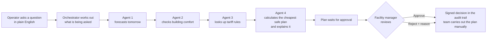
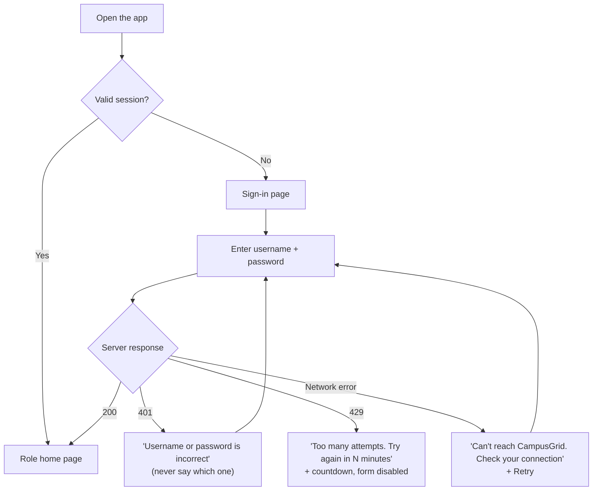
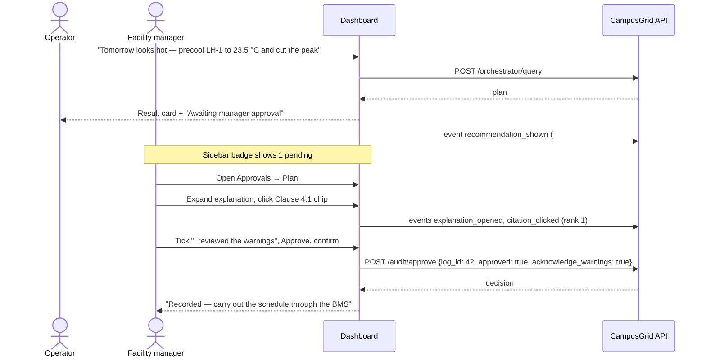

# CampusGrid AI — System User Flow & UI/UX Specification

**What this is:** the blueprint for the CampusGrid AI web dashboard. It covers who uses the system, what
each person can do, every page, how people move between pages, and the edge cases each screen has to
handle. It is written so the frontend can be built from it without reading the backend code.

**Status:** implemented. The dashboard in `frontend/` was rebuilt to this spec on 24 September 2026
and verified in a browser for all three roles, light and dark themes, and a 390 px phone. Section 12
records what changed from the earlier prototype.

**Written against:** the backend as of 24 September 2026. Every screen below maps onto an API that
exists today unless it is marked **(planned)**.

---

## Contents

1. [The system in one page](#1-the-system-in-one-page)
2. [Who uses it: roles and responsibilities](#2-who-uses-it-roles-and-responsibilities)
3. [What each role can do (permission matrix)](#3-what-each-role-can-do-permission-matrix)
4. [Signing in, sessions and signing out](#4-signing-in-sessions-and-signing-out)
5. [Navigation and page map](#5-navigation-and-page-map)
6. [Pages in detail](#6-pages-in-detail)
7. [Key user journeys](#7-key-user-journeys)
8. [States every result screen must handle](#8-states-every-result-screen-must-handle)
9. [Edge cases and system considerations](#9-edge-cases-and-system-considerations)
10. [Analytics instrumentation (what the UI must report)](#10-analytics-instrumentation-what-the-ui-must-report)
11. [UI/UX guidelines and improvements](#11-uiux-guidelines-and-improvements)
12. [Changes made from the earlier prototype](#12-changes-made-from-the-earlier-prototype)
13. [Appendix: page → API map](#13-appendix-page--api-map)

---

## 1. The system in one page

A Sri Lankan university pays a large penalty for the single highest 15-minute spike in electricity
use each month. CampusGrid AI helps the campus energy team avoid that spike by planning when to use
the battery and when to pre-cool buildings.

**It is an advisor, not an autopilot.** It recommends; a human approves; nothing is switched by the
software.



Not every question runs every agent. The orchestrator picks the route:

| The user asks… | Agents that run | What comes back | Needs approval? |
|---|---|---|---|
| "Precool Lecture Hall 1 to 23.5 °C and cut tomorrow's peak charge" | 1 → 2 → 3 → 4 | A dispatch **plan** | **Yes** |
| "What if there is a +3 °C heatwave with double occupancy?" | 1 → 2 | A **simulation** of indoor temperature | No |
| "What is the GP-2 peak tariff rate?" | 3 | **Regulation clauses** with citations | No |
| "Show me tomorrow's demand forecast" | 1 | A **forecast** | No |
| Anything unrelated ("list student names…") | none | A polite **out-of-scope** message | No |

Every question, plan and decision is written to a tamper-evident audit trail.

---

## 2. Who uses it: roles and responsibilities

The system has three sign-in roles. Accounts are created by an administrator; there is no
self-registration.

### Facility Manager (`FACILITY_MANAGER`)
*Example person: the Chief Campus Energy Manager.*

- **Owns the decision.** The only role that can approve or reject a plan.
- Plans, simulates and asks questions like an operator.
- Maintains the regulation library (adds new tariff documents).
- Reviews analytics: are plans being accepted, do people read the explanations?
- Watches system health (which agents are live, whether semantic search is on).

### Operator (`OPERATOR`)
*Example person: the substation shift operator.*

- Day-to-day user. Asks questions, runs what-if simulations, generates dispatch plans.
- **Cannot approve** their own or anyone's plan. A plan they create goes to the manager's queue.
- Reads regulations and the audit trail.
- Does not see analytics or the document upload screen.

### Energy Auditor (`ENERGY_AUDITOR`)
*Example person: a PUCSL compliance auditor or the university's internal auditor.*

- **Read-only.** Cannot plan, simulate or approve.
- Reads the full audit trail, including every agent's output for each plan.
- Verifies that the audit trail has not been altered (one-click integrity check).
- Searches regulations and reads analytics.

### People who benefit but do not sign in
- **The bursar / finance director** — the buyer. Sees savings through reports the manager exports
  (see 11.6, *planned*). A dedicated read-only *Finance Viewer* role is a sensible future addition.
- **Students and staff** — their comfort is protected by the 21.0–25.5 °C guardrail. The system never
  shows or stores anything about individuals.

---

## 3. What each role can do (permission matrix)

✅ allowed · 👁 read-only · — hidden

| Feature | Facility Manager | Operator | Energy Auditor |
|---|:--:|:--:|:--:|
| Overview dashboard | ✅ | ✅ | 👁 (compliance view) |
| Ask CampusGrid (natural-language console) | ✅ | ✅ | — |
| Generate a dispatch plan | ✅ | ✅ | — |
| What-if simulator | ✅ | ✅ | — |
| Forecast view | ✅ | ✅ | — |
| **Approve / reject a plan** | ✅ | — (sees "awaiting manager") | — |
| Approvals queue | ✅ act | 👁 own + all pending | 👁 |
| Regulation search | ✅ | ✅ | ✅ |
| Add / re-index regulation documents | ✅ | — | — |
| Audit trail (list + detail) | ✅ | 👁 | ✅ |
| Audit integrity check | ✅ | — | ✅ |
| Web analytics | ✅ | — | ✅ |
| System status | ✅ | footer summary | footer summary |

**How the UI knows:** the login response and `GET /api/auth/me` return a `permissions` list
(for example `audit:approve`, `rag:ingest`, `analytics:read`). Show or hide every button and menu
item from that list, not from the role name. The server enforces the same rules (401 / 403) — hiding
is for clarity, not security.

| Permission string | Unlocks |
|---|---|
| `orchestrator:query` | Ask CampusGrid |
| `simulation:run` | What-if simulator |
| `optimizer:run` | Dispatch planner |
| `telemetry:read` | Forecast and historical charts |
| `rag:search` | Regulation search |
| `rag:ingest` | Upload / re-index documents |
| `audit:read` | Audit trail, approvals queue (read) |
| `audit:approve` | Approve / reject buttons |
| `analytics:read` | Analytics page, audit integrity check |
| `system:read` | System status page (facility managers) |

---

## 4. Signing in, sessions and signing out

### 4.1 Sign-in flow



**Sign-in page contents**
- Product name and one-line purpose ("Campus energy planning assistant").
- Username, password (with show/hide), **Sign in** button.
- No "remember me" and no sign-up link (accounts are provisioned).
- A small note: "Five failed attempts lock the account for five minutes."
- In demo builds only: a collapsible "Demo accounts" box listing the three demo users. This must be
  removed from production builds.

**Where each role lands after sign-in**

| Role | Home page | Why |
|---|---|---|
| Facility Manager | Overview, with the **Pending approvals** card first | Their main job is deciding |
| Operator | Ask CampusGrid | Their main job is asking and planning |
| Energy Auditor | Audit & Compliance | Their main job is reviewing |

If the user was sent to sign-in from a deep link (for example an approval link), return them to that
page after sign-in.

### 4.2 Session rules
- A session lasts 8 hours (`expires_in_minutes` in the login response). Show a gentle warning 5
  minutes before expiry: "Your session ends in 5 minutes — save your work."
- Any `401` from the API means the session is over: keep the current page's unsaved text (for example
  approval notes) in memory, send the user to sign-in, and restore it after they sign back in.
- A `403` is *not* a session problem. Show "You don't have permission to do this" inline; never log
  the user out for a 403.
- Keep the token in memory (or `sessionStorage`), not `localStorage`, so another browser tab or a
  script injected into the page cannot read it long-term.

### 4.3 Sign-out
User menu → **Sign out** calls `POST /api/auth/logout` (the token is revoked on the server), clears
local state, and returns to the sign-in page. Signing out should work even if the network call fails.

### 4.4 No role switching inside a session
A user who holds more than one job signs out and back in as the other account. A role switcher that
logs in with stored passwords (as the current prototype does) must not exist.

---

## 5. Navigation and page map

Left sidebar on desktop, bottom tab bar (top 4 items) plus a "More" menu on mobile.

```
CampusGrid AI
├── Overview                         all roles (content differs by role)
├── Ask CampusGrid                   manager, operator
├── Plans
│   ├── Approvals queue   (badge: N) all roles (only managers can act)
│   ├── Plan review / {id}           all roles (only managers can act)
│   └── New dispatch plan            manager, operator
├── What-if simulator                manager, operator
├── Forecast                         manager, operator
├── Regulations
│   ├── Search                       all roles
│   └── Library & upload             manager (others: read-only list)
├── Audit & Compliance               all roles
├── Analytics                        manager, auditor
└── System status                    manager (others: summary in footer)

User menu (top right): name · role badge · permissions summary · Sign out
```

Global elements on every page:
- **Pending approvals badge** in the sidebar (managers: action colour; others: neutral).
- **System banner** only when something is degraded (see 9.3), for example "Semantic search is off —
  results use keyword matching only."
- A breadcrumb on detail pages (Plans › Plan #42).

---

## 6. Pages in detail

Each page lists: purpose · who · what is on it · interactions · empty / error states.

### 6.1 Overview (home)

**Purpose:** "What needs my attention today?"

**Manager and operator view**

| Card | Content | Source |
|---|---|---|
| Pending approvals | Count, oldest item age, "Review" button | `GET /api/audit/pending` |
| Tomorrow at a glance | Forecast peak kW and time, number of flagged intervals, the one-paragraph forecast summary | `GET /api/telemetry/forecast` |
| Last approved plan | Savings (LKR and %), peak reduction, approved by / when | `GET /api/audit/logs?record_type=dispatch_recommendation&status=approved&limit=1` |
| Demand chart | 48 half-hour bars: forecast demand, solar, confidence band, peak window (18:00–22:30) shaded | forecast |
| Quick actions | "Plan tomorrow", "Run a what-if", "Look up a rule" | links |

**Auditor view:** replace the planning cards with *Recent decisions*, *Audit integrity status* and
*Plans approved with warnings this month*.

**Empty state:** "No plans yet. Ask CampusGrid to plan tomorrow's battery schedule." with a button.

### 6.2 Ask CampusGrid (natural-language console)

**Purpose:** the main way operators work. One box, plain English, results as cards.

**Layout**
1. **Question box** (multi-line, 2,000-character limit with a counter) and **Ask** button.
2. **Suggested questions** as chips when the box is empty:
   "Plan tomorrow to avoid the evening peak" · "What if it is 3 °C hotter tomorrow?" ·
   "What is the GP-2 peak rate?" · "Show tomorrow's forecast".
3. **Optional scenario controls** (collapsed by default): ambient temperature change (−10 to +15 °C)
   and occupancy multiplier (0–5×). Label them "Override the question" and send them **only if the
   user touched them**; otherwise the numbers in the question are used.
4. **Progress view** while running: the agent steps that apply to this question, each ticking over —
   *Understanding → Forecast → Comfort check → Regulations → Plan & explanation*. The request can take
   several seconds with a real language model.
5. **Result card** — its shape depends on `status` (see table).
6. **History** of this session's questions on the right (desktop) or below (mobile).

| `status` | Result card shows | Primary action |
|---|---|---|
| `ready_for_operator_approval` | Plan summary: savings, peak before → after, the explanation (variant A or B, see 6.4), warnings, "Awaiting manager approval" badge | **Open plan review** |
| `simulation_completed` | Indoor temperature chart with the 21.0–25.5 °C band, "comfort maintained" or "N intervals outside the band" | "Plan for this scenario" |
| `policy_info_retrieved` | Up to 3 clause cards (document, clause, effective date, text) and the extracted numbers | "Open in Regulations" |
| `forecast_ready` | Forecast chart and summary | "Plan tomorrow" |
| `out_of_scope` | The server's explanation of what CampusGrid can help with, plus the suggested-question chips | — |

**Always shown under a result** (when present in the response):
- **"We assumed…" chips** from `assumptions`, for example "Room not recognised — used LH-1",
  "Requested 19 °C is below the comfort minimum — used 21 °C", "No date given — planned for tomorrow".
  Each chip has a "Change" action that pre-fills the question box.
- **Understood as:** intent, room, date, target temperature from `parsed_intent`. If
  `intent_source` is `llm_router`, add "(interpreted by AI)" so the user knows it was a judgement call.
- **Security notice** when `security_flags` is not empty: a neutral grey note, "Part of your request
  looked like an instruction to the system and was treated as plain text. Limits were not changed."
  Never accusatory; never repeat the suspicious text back in bold.

### 6.3 New dispatch plan (structured form)

**Purpose:** the same planning run as the console, for people who prefer a form.

Fields: date (default tomorrow) · room (dropdown from the room inventory) · battery capacity kWh ·
max charge / discharge kW · starting battery level (20–90 % slider, with the 20 % and 90 % limits
drawn on it).

Submitting calls `POST /api/optimizer/dispatch` and opens **Plan review** for the new plan. The form
explains that "Plans are recommendations; a facility manager must approve them."

### 6.4 Plan review (the most important screen)

**Purpose:** give the manager everything needed to make a confident yes/no decision, and nothing that
makes them guess.

**Header:** Plan #id · room · date · created by · created at · status pill
(Pending / Approved / Rejected / Expired) · time left before it expires (24 h).

**Section A — The answer (above the fold)**
- Three big numbers: **Savings (LKR)**, **Savings (%)**, **Peak: X kW → Y kW**.
- The explanation:
  - *Variant A (concise):* the one-line `explanation_concise`, with "Show full explanation".
  - *Variant B (cited):* the full `explanation` with its citations inline.
  - Which one the user sees comes from `ab_variant`; both can expand to the other. Expanding fires
    `explanation_opened` (section 10).
- **Verification badge** from `faithfulness_audit`: "Numbers checked against the solver ✓" or
  "⚠ Explanation failed the fact check — rely on the numbers below".

**Section B — The schedule**
- Chart 1: grid import before vs after, 48 half-hour points, peak window shaded.
- Chart 2: battery charge (up) / discharge (down) bars.
- Chart 3: battery level (kWh) with the 20 % and 90 % limits drawn as lines (limits come from
  `battery_limits` stored with the plan).
- A **"View as table"** toggle under every chart (accessibility, and auditors like tables).
- Binding limits from `solver_summary.binding_constraints`: "Savings were limited by: battery power
  (100 kW) at 18:30…"

**Section C — Why these numbers (inputs and sources)**
- Tariff used: peak / day / off-peak rates, windows, demand charge. Each figure has a **source chip**:
  "Clause 4.1 — PUCSL GP-2" when `provenance` is `retrieved`; an amber "reference value" chip when it
  was not found or was rejected. Clicking a chip opens the clause (fires `citation_clicked` with its
  rank).
- Comfort check: "Indoor temperature stays within 21.0–25.5 °C" or "N intervals outside the band".
- Forecast summary sentence from Agent 1.
- Full citation list (ranked).

**Section D — Warnings** (only if `warnings` is not empty)
An amber panel listing each warning in plain language.

**Section E — Decision panel** (sticky at the bottom on desktop; full-width at the end on mobile)

| Viewer | Panel shows |
|---|---|
| Manager, plan pending | **Approve** and **Reject** buttons, a notes box. If there are warnings: a required checkbox "I have reviewed the N warnings above". |
| Manager, plan decided | "Approved by *name* at *time*" (or Rejected + reason). No buttons. |
| Operator | "Waiting for a facility manager to review." |
| Auditor | Decision details only. |

Decision rules the UI must follow (the server enforces them too):
- **Reject** requires a reason; the button stays disabled until the notes box has text.
- **Approve with warnings** requires the acknowledgement checkbox (sends `acknowledge_warnings: true`).
- A confirmation step before either action: "Approve this plan? It will be recorded permanently and
  cannot be undone."
- After approving: show "Recorded. CampusGrid does not operate equipment — carry out the schedule
  through the building management system." plus a **Download execution checklist** button (a
  plain-text list of battery actions per time range, with a sign-off line).

### 6.5 Approvals queue

A list of pending plans: plan id, room, date, savings, warnings count, created by, age, **expires in**.
Sort by expiry (soonest first). Filters: has warnings / no warnings, created by me.

- Manager: each row has "Review".
- Operator / auditor: rows open Plan review read-only.
- Plans older than 24 h drop out as **Expired** with a "Re-run with today's data" action.
- Empty state: "Nothing waiting for approval."

### 6.6 What-if simulator

**Purpose:** test a scenario on building comfort before planning around it.

Controls: date · starting indoor temperature (18–35 °C) · outdoor temperature change (−10 to
+15 °C) · occupancy multiplier (0–5×, with presets "Normal", "Exam hall 1.5×", "Crowd surge 2.5×") ·
**Run simulation**.

Output: indoor temperature line over 48 intervals with the comfort band shaded; outdoor temperature as
a faint second line; a verdict banner ("Comfort maintained" / "N intervals too hot"); the number of
violations; a note when `weather_source` is `offline-fallback` ("Live weather unavailable — using a
typical day").

Action: "Plan for this scenario" → opens Ask CampusGrid pre-filled.

### 6.7 Forecast

The 48-interval demand and solar forecast with confidence band, flagged intervals marked, the forecast
summary, and a toggle to overlay the historical profile (which is privacy-noised — label it
"Historical (privacy-protected)").

### 6.8 Regulations — Search

- Search box with example queries; result count selector (1–5).
- Each result: rank, document title, clause, section title, **effective date**, clause text with the
  query words highlighted, and **"Matched by: meaning · keywords"** badges from `matched_by`.
- Clicking a result expands it and fires `search_result_clicked` with its rank.
- If semantic search is off (system status), show "Keyword matching only" next to the box.
- Empty result: "No matching clause. Try the clause number (for example 'Clause 6.3') or simpler words."

### 6.9 Regulations — Library & upload

- Table of indexed documents and clause counts (`GET /api/rag/documents`).
- **Manager only — Add regulation:** paste text or Markdown, document title, effective date
  (YYYY-MM-DD) → **Add**. File upload for PDF / TXT / MD is **(planned)**; today, files go through
  the corpus folder and **Re-index library**.
- After upload, show the server's result in plain words:
  - "3 clauses added."
  - "2 clauses were already in the library and were skipped."
  - "1 clause was **quarantined** and not added — reason: *instruction-like text detected*." with the
    clause reference. Quarantine is the defence against poisoned documents; make it visible.
- Warn before re-indexing: "Re-indexing re-reads every file in the corpus folder. Clauses already
  present are skipped."

### 6.10 Audit & Compliance

- Filters: record type (plan, decision, simulation, regulation lookup, forecast, out-of-scope,
  document upload), status (pending, approved, rejected, expired, not required), user, date range.
- Table: id · time (local, Asia/Colombo) · user · type · question/summary · status.
- **Record detail drawer:** the question, what the system understood, each agent's output as a
  collapsible step (Agent 1 → 4, with timing), the final decision, the linked approval decision, and
  the record's signature.
- **Integrity check** (manager, auditor): button "Verify audit trail" → green "All N records verified"
  or red "Record #X does not match its signature — the trail may have been altered." This calls
  `GET /api/audit/verify`.
- **Export CSV** of the filtered table.

### 6.11 Analytics (manager, auditor)

Four panels, each with a one-sentence "what this tells you":

| Panel | Visual | Source |
|---|---|---|
| **Acceptance funnel** — do people act on plans? | Funnel: Shown → Explanation opened → Citation clicked → Decided, with approval rate of decided plans | `/api/analytics/funnel` |
| **Explanation A/B test** — concise vs cited | Two columns: plans shown, approved, rejected, approval rate; z-statistic and p-value; a "Not enough data yet (need 30 decisions per variant)" notice when `sufficient_sample` is false | `/api/analytics/ab-test` |
| **What people ask about** | Bar chart of intent clusters with top keywords and example questions | `/api/analytics/query-clusters` |
| **Citation usefulness** | Mean reciprocal rank of the first clicked citation; clicks by rank | `/api/analytics/citation-ctr` |

Never present a non-significant A/B difference as a winner.

### 6.12 System status (manager)

Which provider is active for the language model, embeddings, vector store and database; which agents
run member code versus a reference baseline (`agent_slices`); whether semantic search is enabled.
Plain-language labels ("Comfort check: using the reference model").

---

## 7. Key user journeys

### J1 — Plan tomorrow and get it approved (the core journey)



**Alternative paths**
- The manager rejects → reason required → the operator sees the reason on the plan.
- Another manager decided first → the server returns 409 → show "Already approved by *name* at
  *time*" and refresh the page. No duplicate decision is possible.
- The plan is more than 24 hours old → 409 → "This plan has expired. Re-run it with today's data."

### J2 — Check a hypothetical before planning
Operator opens **What-if** → sets +3 °C and 1.5× occupancy → sees 6 intervals too hot → clicks
"Plan for this scenario" → Ask CampusGrid pre-fills "Plan tomorrow for a +3 °C day with 1.5×
occupancy" → J1 continues.

### J3 — Answer a tariff question
Any role opens **Regulations** (or asks in the console) → "What is the maximum demand charge?" →
Clause 6.3 at rank 1 with "LKR 1,100 per kVA" highlighted → clicks it (analytics records rank 1).

### J4 — Add a new tariff revision
Manager opens **Library & upload** → pastes the new schedule → sees "4 added, 0 skipped, 1 quarantined
(implausible figure: peak rate 0.00 outside 10–200)" → fixes the source text or leaves it out → the
next plan's tariff chips point at the new clauses.

### J5 — Audit a decision
Auditor signs in → lands on **Audit & Compliance** → filters "decisions, last 30 days" → opens a
decision → follows the link to the plan → expands each agent step → runs **Verify audit trail** →
green result.

### J6 — Review adoption
Manager opens **Analytics** → sees 40 % of plans decided without anyone opening the explanation →
decides to make the concise explanation the default for everyone once the A/B test reaches
significance.

---

## 8. States every result screen must handle

| State | What the user sees |
|---|---|
| **Idle** | Suggested questions / empty form with examples |
| **Running** | Step-by-step progress; the submit button disabled so the request cannot be sent twice |
| **Success** | The result card for that intent |
| **Success with assumptions** | Result + "We assumed…" chips |
| **Success with warnings** | Result + amber warnings panel; approval needs acknowledgement |
| **Out of scope** | Friendly scope message + suggestions |
| **Validation error (422)** | Inline message next to the field (for example "Date must be YYYY-MM-DD") |
| **Forbidden (403)** | "You don't have permission to do this." |
| **Session ended (401)** | Redirect to sign-in, then back, with drafts restored |
| **Conflict (409)** | Explain what changed (already decided / expired / not approvable) and refresh |
| **Too large (413)** | "That text is too long (limit 1 MB)." |
| **Locked (429)** | Countdown until retry |
| **Agent failure (502)** | "The *comfort check* step could not finish." (use `details.agent`), with Retry; keep the question text |
| **Server error (500)** | "Something went wrong on our side. Reference: *X-Request-ID*" — show the request ID so support can find the log |

---

## 9. Edge cases and system considerations

### 9.1 Input and understanding
- **Unknown room** ("optimize CR-2"): the plan runs for the default room and says so in an assumption
  chip. Offer a room picker from the inventory rather than failing.
- **No date** means tomorrow (day-ahead planning). Weekday names ("on Friday") resolve to the next
  such day. Show the resolved date, never just "tomorrow".
- **Setpoints:** outside 18–30 °C are ignored (24 °C used); 18–21 °C and 25.5–30 °C are clamped to
  the comfort band. Always shown as an assumption chip.
- **Several numbers in one sentence** ("+4 degrees heatwave, precool to 23 °C"): the one after "+",
  "plus" or "rise of" is the heatwave change; the other is the setpoint. Show both in "Understood as".
- **Very long input** is cut at 2,000 characters in the console; the counter prevents surprise.
- **Pasted text with invisible characters** is cleaned on the server; the UI does not need to do
  anything special, but should not display raw control characters in history.

### 9.2 Plans and approvals
- **Warnings** block one-click approval by design.
- **Every plan can carry a comfort warning today** because the comfort check simulates a default
  cooling curve, not the plan's own pre-cooling (see the integration report). Design the warnings
  panel to be read often, not as a rare alarm, until that is fixed.
- **Concurrent managers:** the second decision always gets 409; there is never a double approval.
- **Expiry:** plans older than 24 hours cannot be approved.
- **Nothing is actuated.** Every approval screen must say so, so no one assumes the battery has been
  scheduled.

### 9.3 Degraded modes (show a banner, keep working)
| Condition | How the UI finds out | What to show |
|---|---|---|
| Semantic search off (mock embeddings) | `dense_search_enabled: false` from health | "Keyword matching only" next to search |
| Live weather unavailable | `weather_source: "offline-fallback"` | "Using a typical-day weather curve" |
| An agent is on its reference baseline | `agent_slices` | System status page only (not a user-facing banner) |
| Language model offline | 502 on explanation step | Retry; plan numbers are still shown if returned |

### 9.4 Time, units and numbers
- The day has 48 half-hour intervals labelled by start time ("18:00" means 18:00–18:30).
- Server timestamps are UTC; display in **Asia/Colombo** with the zone on hover.
- Money: "LKR 16,213" (no decimals in summaries; 2 decimals in tables). Power in kW, energy in kWh,
  demand charge in LKR/kVA, temperature in °C to one decimal.
- Peak window 18:00–22:30 is always shaded the same way on every chart.

### 9.5 Privacy and security
- No screen shows individual students, staff schedules or room bookings; occupancy appears only as
  counts.
- Historical meter data is privacy-noised on the server; label it as such.
- Never render Markdown images or links from model-generated text (explanations, summaries); render
  explanations as plain text. This closes the image-URL exfiltration trick.
- Show the `X-Request-ID` on error screens, never stack traces.

---

## 10. Analytics instrumentation (what the UI must report)

The analytics page only works if the dashboard reports these events with
`POST /api/analytics/event`. The server fills in the user, role and A/B variant itself; the browser
cannot log queries or decisions (the server records those).

| Event | Fire when | Required fields |
|---|---|---|
| `recommendation_shown` | A plan's result card or Plan review first renders (once per plan per view) | `audit_log_id` |
| `explanation_opened` | The user expands the other explanation variant or "Show full explanation" | `audit_log_id` |
| `citation_clicked` | A citation or tariff source chip is opened from a plan | `audit_log_id`, `rank`, `clause_reference` |
| `search_result_clicked` | A result is opened on the Regulations search page | `rank`, `query_text`, `session_id` |

Rules: fire and forget (never block the UI on it); debounce duplicates; do not send events for demo
or test accounts in production analytics.

---

## 11. UI/UX guidelines and improvements

### 11.1 Principles
1. **Numbers first, prose second.** Savings, peak and comfort verdict are visible before any paragraph.
2. **Every number has a source.** Tariff figures carry a clause chip; solver figures carry the "checked"
   badge. If a number is a default, say so in amber.
3. **Deciding is deliberate.** Approve/Reject are never one click away from a list; they live on the
   Plan review page with a confirmation.
4. **Show what the system assumed.** Assumption chips are more trustworthy than silent defaults.
5. **Advisory, always.** Repeat that nothing is switched automatically wherever a decision is made.

### 11.2 Visual language
- Status colours with text labels and icons (never colour alone): Pending (blue), Approved (green),
  Rejected (grey), Expired (grey, struck), Warning (amber), Failure (red).
- One chart palette across the app: demand, solar, battery, grid, comfort band always the same colours.
- Light and dark themes; the current prototype is dark-only.

### 11.3 Accessibility (also part of the Responsible-AI audit)
- Every chart has a "View as table" alternative and a one-sentence text summary for screen readers.
- Keyboard: every action reachable by Tab; the decision panel's checkbox, notes and buttons in a
  logical order; visible focus rings.
- Contrast at least WCAG AA; targets at least 44 × 44 px on touch screens.
- Do not auto-play or auto-refresh content that moves focus.

### 11.4 Responsiveness
- Managers approve from phones: Plan review must work at 360 px wide — numbers, warnings and the
  decision panel first; charts below, horizontally scrollable.
- Tables collapse to cards on small screens.

### 11.5 Performance feel
- Show the agent step list immediately on submit; a full plan can take several seconds with a real
  language model.
- Cache the room list, role permissions and system status for the session.

### 11.6 Improvements worth planning
| Improvement | Why |
|---|---|
| Notification (email or in-app) when a plan is waiting | Plans expire after 24 h |
| PDF version of the execution checklist (the plain-text checklist is built) | The bursar wants a formatted record |
| Compare two plans side by side | Managers ask "what if we precool to 24 instead of 23.5?" |
| Monthly savings report for the bursar | The buyer is finance, not operations |
| "Why was this rejected?" summary on the operator's home | Closes the feedback loop |
| Room picker with tier label (Tier 0 never curtailed) | Makes the fairness rule visible once Agent 4 enforces tiers |
| Sinhala / Tamil interface language | Campus operations staff |

---

## 12. Changes made from the earlier prototype

The first prototype in `frontend/` was built before the backend's security and approval work. The
rebuild made every change below (all done as of 24 September 2026):

| Earlier prototype behaviour | Behaviour now |
|---|---|
| Logs in automatically as `admin` with a hard-coded password on page load | A real sign-in page (section 4) |
| "Switch role" buttons that log in with stored passwords | Removed; sign out and sign in instead |
| Token kept in `localStorage` | Memory or `sessionStorage` |
| Sends `user_id` with every query | Omit it; the server takes the user from the token |
| Always sends `perturb_temp_delta_c: 0` and `perturb_occ_multiplier: 1` | Send them only when the user moved the sliders (otherwise the query text is ignored) |
| Analytics page reads `funnel_conversion_rate`, `ab_test_active_variant` | Read the new structures (`acceptance_funnel`, `ab_test`, `query_clusters`, `citation_click_through`) |
| No handling of 401 / 403 / 409 / 429 / 502 | Section 8 |
| No analytics events | Section 10 |
| Buttons shown regardless of role | Driven by the `permissions` list |

---

## 13. Appendix: page → API map

All endpoints need `Authorization: Bearer <token>` except health and login.

| Page / action | Method & path | Roles |
|---|---|---|
| Sign in | `POST /api/auth/login` | public |
| Current user & permissions | `GET /api/auth/me` | any signed-in |
| Sign out | `POST /api/auth/logout` | any signed-in |
| Role descriptions | `GET /api/auth/roles` | public |
| System status | `GET /api/health` | public |
| Room list (pickers) | `GET /api/campus/rooms` | all |
| Ask CampusGrid | `POST /api/orchestrator/query` | manager, operator |
| New dispatch plan | `POST /api/optimizer/dispatch` | manager, operator |
| What-if simulator | `POST /api/simulation/what-if` | manager, operator |
| Forecast | `GET /api/telemetry/forecast?date=&room=` | manager, operator |
| Historical (privacy-noised) | `GET /api/telemetry/historical?date=` | manager, operator |
| Regulation search | `POST /api/rag/search` | all |
| Library list | `GET /api/rag/documents` | all |
| Add / re-index regulations | `POST /api/rag/ingest` | manager |
| Audit trail | `GET /api/audit/logs?limit=&record_type=&status=&include_details=` | all |
| Audit record | `GET /api/audit/logs/{id}` | all |
| Approvals queue | `GET /api/audit/pending` | all |
| Approve / reject | `POST /api/audit/approve` | manager |
| Verify audit trail | `GET /api/audit/verify` | manager, auditor |
| Report a UI event | `POST /api/analytics/event` | all |
| My A/B variant | `GET /api/analytics/ab/assignment` | all |
| Analytics | `GET /api/analytics/summary` · `/funnel` · `/ab-test` · `/query-clusters` · `/citation-ctr` | manager, auditor |

**Error body (all endpoints):** `{ "success": false, "error_code": "...", "message": "...", "details": {...} }`
— show `message`; branch on `error_code` (`AUTHENTICATION_FAILED`, `PERMISSION_DENIED`,
`ACCOUNT_TEMPORARILY_LOCKED`, `WORKFLOW_CONFLICT`, `VALIDATION_ERROR`, `AGENT_EXECUTION_FAILED`,
`MALICIOUS_INPUT_DETECTED`, `ENTITY_NOT_FOUND`, `INTERNAL_SERVER_ERROR`).
